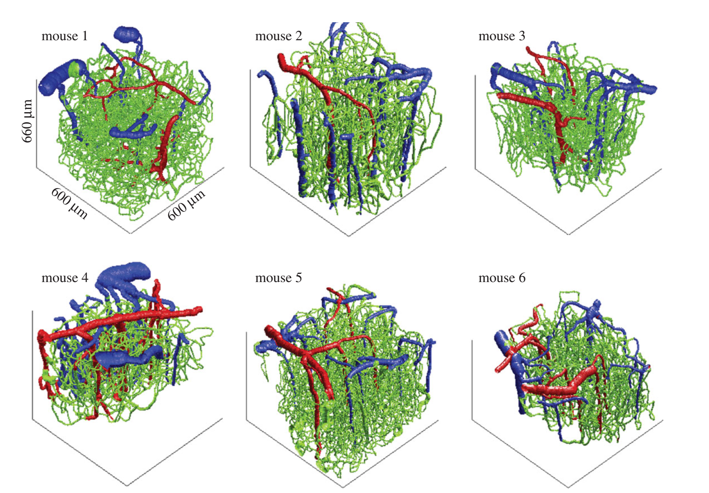

# VAN_modeling

The vascular anatomical network (VAN) model computes BOLD signals of mouse microvascular stacks obtained from in-vivo two photon microscopy measurements. With this bottom-up model, you can explore different physiological effects on the oxygen distribution, the blood flow distribution and BOLD signals.

Here we provide two versions of instructions for users. The ‘Short Introduction to VAN’ outlined the steps to call the functions, which should be sufficient for people who are only interested in obtaining the results. The ‘Not So Short Introduction to VAN’ includes a review of VAN modeling and more details, which is for researchers who need more information or want to integrate our data with other computational methods. 

Any comments are welcome, and we would also love to discuss potential research topics. Emails with any questions can be sent to Xiaojun Cheng xcheng17@bu.edu, David Boas dboas@bu.edu. Most importantly, have fun with VAN!

 
Figure 1. Three-dimensional rendering of the six vascular stacks acquired with two-photon microscopy. 

## Citations
Cheng, X., Berman, A.J.L.J., Polimeni, J.R., Buxton, R.B., Gagnon, L., Devor, A., Sakadžić, S., and Boas, D.A., “Dependence of the MR signal on the magnetic susceptibility of blood studied with models based on real microvascular networks.,” Magnetic resonance in medicine (2019).

Gagnon, L., Sakadžić, S., Lesage, F., Pouliot, P., Dale, A.M., Devor, A., Buxton, R.B., and Boas, D.A., “Validation and optimization of hypercapnic-calibrated fMRI from oxygen-sensitive two-photon microscopy.,” Philosophical transactions of the Royal Society of London. Series B, Biological sciences 371(1705), 20150359 (2016).

Gagnon, L., Sakadžić, S., Lesage, F., Musacchia, J.J., Lefebvre, J., Fang, Q., Yücel, M.A., Evans, K.C., Mandeville, E.T., et al., “Quantifying the microvascular origin of BOLD-fMRI from first principles with two-photon microscopy and an oxygen-sensitive nanoprobe.,” The Journal of neuroscience : the official journal of the Society for Neuroscience 35(8), 3663–3675 (2015).

